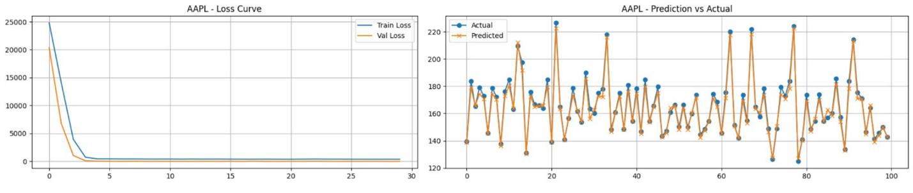
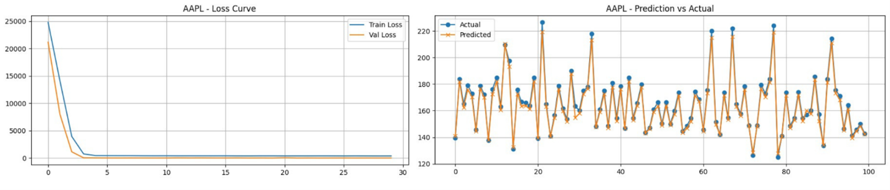
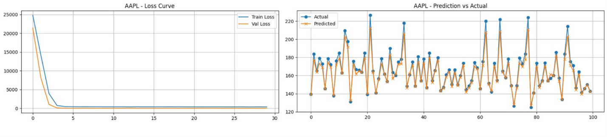

# 📈 Deep Learning-based Stock Market Prediction Using Historical Prices + Topic-Distributed News Sentiment

This project was developed as part of the **Research Methodology** course.  
The primary objective is to investigate how deep learning models can predict stock market movements by combining:

- 🟦 **Historical stock price patterns**
- 🟧 **Topic-distributed sentiment extracted from financial news**

I served as the **main developer**, responsible for building, integrating, and evaluating the complete deep learning pipeline.

---

## 🚀 Project Overview

We designed a **dual-branch deep learning architecture** that processes two different inputs:

### 1️⃣ Price Branch
Models used:
- **LSTM**
- **GRU**
- **TCNN** (Temporal Convolutional Neural Network)

These models learn temporal patterns contained in historical stock price data.

---

### 2️⃣ News–Sentiment Branch
Techniques used:
- **FinBERT** → extracting sentiment vectors from financial news  
- **BERTopic** → generating topic distributions for contextual market understanding  

This branch provides **market context signals** that are combined with price features to improve prediction performance.

---

## 📊 Results

### Model Prediction Plots

#### LSTM Prediction  

#### GRU Prediction  

#### TCNN Prediction  

**Finding:**  
> **GRU** outperformed the other models due to its ability to efficiently capture long-term dependencies while remaining computationally stable.

---

## 🧩 Challenges & Learnings

This project provided hands-on experience solving real-world machine learning and data processing issues, including:

- Synchronizing **news events** with **stock price timelines**
- Extracting meaningful sentiment signals from unstructured financial text
- Topic modeling using **BERTopic**
- Handling dataset imbalance and temporal gaps
- Tuning deep learning models for volatile and noisy financial data
- Evaluating regression performance using RMSE, MAE, and visual diagnostics
- Managing long training times and ensuring reproducibility

---

## 👨‍💻 Authors & Contributions

- **Rafi Hazel Tafara** — Designed the deep learning architecture  
- **Yosepril Zhounggi** — Conducted literature review & contributed to paper writing  
- **Muhammad Fikri Hasani** — Supervising lecturer  
- **Ayu Maulina** — Supervising lecturer  

---

## 📄 Research Paper

**Read the full paper here:**  
👉 [Procedia Computer Science (Elsevier) – Published Version](https://lnkd.in/e5bCnntw)
